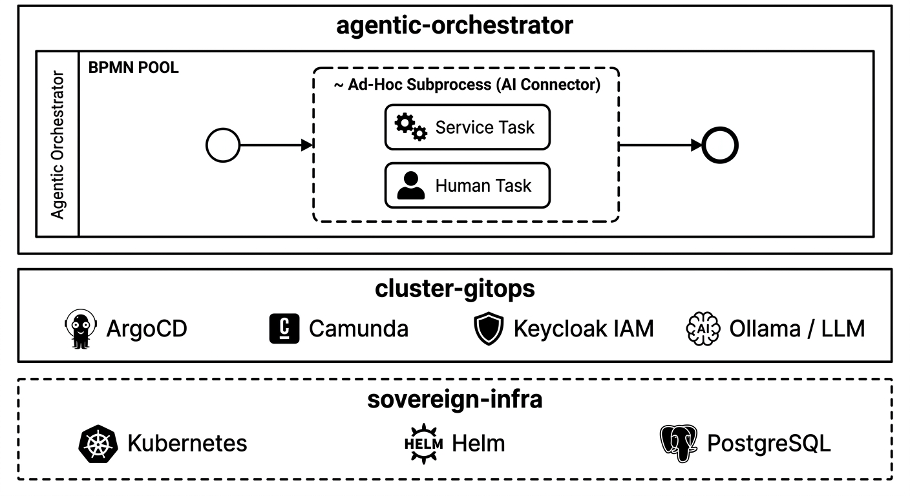

# Sovereign Agentic Orchestration Stack 🚀

  
  
<i>Architecture Overview: Deterministic Orchestration meets Intelligent Execution.</i>

## ⚡ Executive Summary

The **Sovereign-Agentic-Orchestration-Stack** is a reference architecture designed for highly regulated industries (FinTech, Defense, Health). It demonstrates how **Deterministic Orchestration** meets **Intelligent Execution** by bridging the gap between traditional BPMN and autonomous AI agents.

### 🛑 Repository Role: Documentation & Architecture Hub
This repository serves strictly as the central **Documentation & Architecture Reference**. The actual source code is distributed across three specialized repositories, structured exactly as depicted in the diagram above:

| Layer | Responsibility | Corresponding Repo | Location in Diagram |
| :--- | :--- | :--- | :--- |
| **Process Logic** | Business BPMN, AI Prompts, Human-in-the-Loop workflows. | `agentic-orchestrator` | **Top Box** (Agentic Decision Orchestration) |
| **Platform Ops** | GitOps pipelines (ArgoCD), Camunda/Zeebe deployment, Keycloak IAM. | `cluster-gitops` | **Middle Box** (Management Shell) |
| **Infrastructure**| K3s/Helm charts, NVIDIA GPU bootstrapping, Resource profiling. | `sovereign-infra` | **Bottom Footer** (Dashed Boundary) |

*   **Status:** 🚧 Work in Progress
*   **Goal:** Demonstrating secure, scalable, and auditable AI orchestration using an **"Adaptive Case Management 2.0"** approach with 100% data sovereignty.

## 🔍 Key Feature: Agent Explainability (Decision Trail)

In regulated environments, the "Black Box" nature of AI is the primary blocker for production adoption. This architecture explicitly addresses this by implementing a comprehensive **Decision Trail**, leveraging upcoming **Camunda 8 Governance features**.

### The Value Proposition
For operations engineers, compliance stakeholders, and developers, this stack transforms opaque AI actions into **auditable business processes**. Every decision made by an autonomous agent is backed by a full forensic trail.

### 🛠️ Transparency & Audit Layers
To ensure "Human-in-the-Loop" or "Human-on-the-Loop" integrity, the architecture captures:

*   **Prompt & Response:** Full visibility into the exact instructions and raw LLM outputs.
*   **Reasoning Path:** Exposure of intermediate "Chain of Thought" (CoT) and logic steps.
*   **Tool Calls:** Precise logging of which internal/external tools or APIs the agent invoked.
*   **Memory Context:** A snapshot of short-term and long-term memory state at the moment of decision.

### 🎯 Strategic Impact
*   **Regulatory Compliance:** Provides the evidence required for **BaFin, DORA**, or Ethical AI frameworks (and defense contexts like RoE).
*   **Trust & Validation:** Enables operators to validate autonomous decisions *before* escalation.
*   **Rapid Debugging:** Accelerates failure analysis by pinpointing exactly where an agent's reasoning diverged from expected business logic.

> **Architecture Note:** By using **Camunda 8** as the orchestrator, we move from "unreliable automation" to "governed autonomy." We don't just execute AI; we manage it within a strict BPMN container.
> **Disclaimer:** This repository is a reference architecture for educational and demonstrative purposes. It does not constitute a certified solution for specific regulatory frameworks. Users are responsible for conducting their own compliance audits (e.g., BaFin, DORA) before production use.

## 🏗️ Technical Stack

We prioritize **Single Source of Truth**, **Data Sovereignty**, and **Hardware Efficiency**.

### Core Technologies
| Category            | Technology | Rationale                                                                                |
|:--------------------| :--- |:-----------------------------------------------------------------------------------------|
| **Orchestrator**    | **Camunda 8 (Zeebe)** | Deterministic backbone; native logging for full audit trails.                            |
| **Local AI Engine** | **Ollama** (Local) | On-prem inference ensuring sensitive data never leaves the facility.                     |
| **IAM**             | **Keycloak** (OIDC) | Centralized security for all endpoints and AI interactions.                              |
| **Database**        | **PostgreSQL** | Transactional consistency for process state and metadata (Camunda), IAM data (Keycloak). |
| **Deployment**      | **K3s + ArgoCD** | Lightweight K8s with GitOps self-healing capabilities.                                   |

## 🎯 Target Runtime Environments

> **"One Stack, Any Scale"**  
> This project follows a unified GitOps approach. Whether deploying to a high-power workstation or a power-efficient edge device, the architecture remains identical.

| Environment | Specs (Tested) | Use Case |
| :--- | :--- | :--- |
| **High-Power Desktop** | 64 GB RAM / 16 GB VRAM (RTX) | Development, Heavy Load Testing, Large LLMs |
| **Edge AI (Jetson)** | 16 GB Unified Memory (Orin Nano) | Industrial Edge, Power-Efficient continuous operations |
| **Minimal / Laptop** | 16 GB RAM (CPU only) | Proof of Concept, Local Process Testing |

### ⚙️ Multi-Platform Strategy
Deployment is managed via **Helm profiles**, allowing seamless switching between resource-constrained and high-performance hardware:

*   **Resource Efficiency:** JVM and PostgreSQL heap sizes are dynamically adjusted based on the target profile.
*   **Hardware Acceleration:** Automatic detection and utilization of NVIDIA CUDA cores for LLM inference (where available).
*   **Architecture Agnostic:** Full support for both `x86_64` and `arm64` (Multi-Arch Docker Images).

### ⚖️ Architectural Decisions and Strategy

#### Why use Agentic AI
*	Usage saves time compared to traditional BPMN.

#### Why Camunda over Open Source Forks (Operaton/CIB seven)?
*   **Native Agentic Orchestration:** In Camunda 8, Agentic AI is integrated via dedicated Connectors and Ad-hoc Subprocesses. This provides out-of-the-box visibility in Camunda Operate and native analytics in Optimize. In many Open Source forks, agent logic often relies on external task workers, which can make it harder to maintain a "Single Source of Truth" for audit trails without significant custom development.
*   **Alignment with Sovereign AI Trends:** This stack aligns with the strategic shift toward Agentic Orchestration (as highlighted at Camunda Con 2026). By using the current industry standard, this architecture ensures compatibility with upcoming governance and AI-safety features that are critical for regulated environments.
*   **Commitment to Self-Managed Data Sovereignty:** While there is a strong industry trend toward SaaS, industries with high security requirements (FinTech, Defense) necessitate Self-Managed deployments. This stack is designed to leverage Camunda 8’s advanced features while maintaining 100% data sovereignty on-premises or in private clouds.

#### Why No Spring AI?
I evaluated Spring AI but deliberately excluded it to preserve architectural integrity:
*   **Logic Decoupling:** Business logic belongs in the orchestration layer (`agentic-orchestrator`), not hardcoded in Java binaries. This allows for rapid prompt-tuning and model-swapping without redeploying the entire service.
*   **Native Auditability:** Using the native Camunda Connector ensures that prompts, reasoning paths, and tool calls are logged directly into Zeebe/Operate for compliance audits.
*   **Process Transparency:** Non-technical stakeholders can visualize agent decision paths directly in BPMN diagrams without parsing application logs.

#### Why PostgreSQL over ElasticSearch/OpenSearch?
I chose a relational database in combination with Camunda RDBMS-Exporter to optimize for **Data Integrity** and **Resource Efficiency**:
*   **Compliance First:** Relational DBs (PostgreSQL) support ACID transactions, which are critical for maintaining a consistent audit trail for "Decision Trails."
*   **Lower Footprint:** In local/edge environments, PostgreSQL offers a significantly smaller resource overhead compared to heavy NoSQL search engines.
*   **Architectural Simplicity:** By consolidating metadata, IAM data (Keycloak), and process state into a single database technology, the operational complexity for air-gapped or resource-constrained deployments is drastically reduced.

#### Why GitOps (ArgoCD)?
I treat Infrastructure as Code rather than separate utility:
*   **Unified State:** By embedding ArgoCD into the cluster logic itself, we eliminate external network dependencies and simplify self-healing mechanisms.
*   **Scalability:** A single deployment strategy works from a laptop to an air-gapped server farm.

## 🗺️ Roadmap & Phases

- [ ] **Phase 1:** Kubernetes Infrastructure (Minikube, Helm, ArgoCD)
- [ ] **Phase 2:** Camunda 8 Self-Managed Deployment & Service Provider Setup
- [ ] **Phase 3:** Agentic AI Connector Setup
- [ ] **Phase 4:** Process Application (BPMN, Forms, Java Job Workers)

---

## 📄 License

This project is licensed under the MIT License - see the [LICENSE](LICENSE) file for details.
